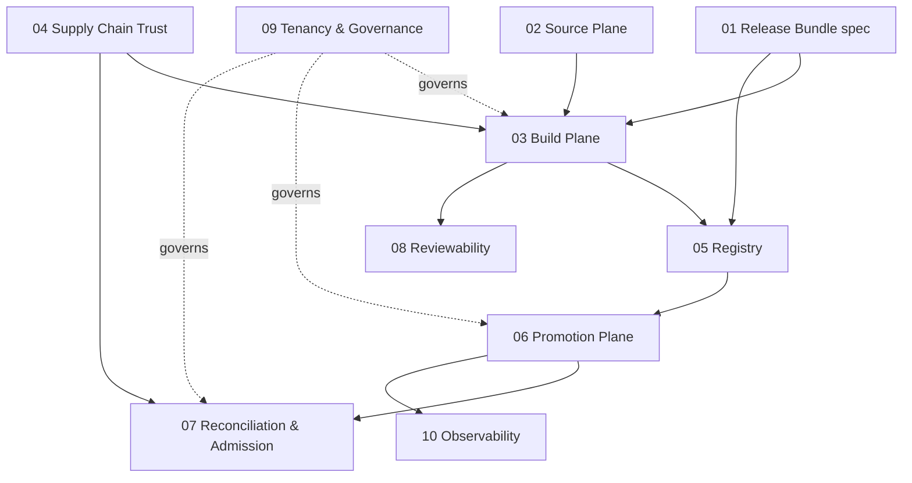

# ARCH-2026-CI-ARTIFACT-001 — Implementation Document Set

**Parent document:** `ci-artifact-architecture-2026.md`
**Audience:** Product team — architects and engineers
**Purpose:** Decompose each principle/plane of the foundational architecture into an implementable sub-document with an executive summary, detailed design guidance, a roadmap, and Jira-feature-level work definitions.

## Document Map

| Doc | Title | Covers | Feature prefix |
|---|---|---|---|
| 01 | Release Bundle Specification | §3, P1, P2 | `RB` |
| 02 | Source Plane | §4.1, P6 | `SRC` |
| 03 | Build Plane | §4.2, P4 | `BLD` |
| 04 | Supply Chain Trust (Signing & Provenance) | P3, cross-cutting | `SCT` |
| 05 | Artifact Plane (Registry as System of Record) | §4.3 | `REG` |
| 06 | Promotion Plane | §4.4 | `PRM` |
| 07 | Reconciliation & Admission | §4.5 | `REC` |
| 08 | Reviewability & Hydration Mirror | §6, P5 | `REV` |
| 09 | Multi-Tenancy & Governance | §7 | `GOV` |
| 10 | Observability & Deployment Ledger | §8 | `OBS` |

## Cross-Document Dependency Graph (feature sequencing)

**Critical path:** 01 → 04 → 03 → 05 → 06 → 07. Documents 02, 08, 09, 10 can proceed in parallel once their upstream contracts (marked in each doc) are frozen.

## Conventions Used in All Sub-Documents

- **Feature IDs** follow `FEAT-<prefix>-NN`. Each is scoped to be a Jira Feature (epic-adjacent): 2–8 weeks of team effort, independently demonstrable, with defined outcome criteria. Stories are intentionally not decomposed.
- **Roadmap phases** align to the parent document's Phase 0–4 (months 0–36).
- **"Contract freeze"** markers indicate the artifact/API decisions that downstream documents depend on; these should be ratified via ADR before dependent features start.
- **References** are listed per document; the shared canonical set is:
  - OCI Distribution Spec v1.1 (referrers API) — https://github.com/opencontainers/distribution-spec
  - OCI Image Spec (artifact guidance) — https://github.com/opencontainers/image-spec
  - SLSA v1.0 specification — https://slsa.dev/spec/v1.0/
  - in-toto Attestation Framework — https://github.com/in-toto/attestation
  - Sigstore (Cosign, Fulcio, Rekor) — https://docs.sigstore.dev/
  - Argo CD OCI sources — https://argo-cd.readthedocs.io/en/latest/user-guide/oci/
  - Argo CD Source Hydrator — https://argo-cd.readthedocs.io/en/latest/user-guide/source-hydrator/
  - Kargo documentation — https://docs.kargo.io/
  - Akuity, "The Rendered Manifests Pattern" — https://akuity.io/blog/the-rendered-manifests-pattern
  - Cloudogu GitOps Patterns catalog — https://github.com/cloudogu/gitops-patterns
  - ORAS (OCI Registry As Storage) — https://oras.land/
  - CNCF Software Supply Chain Best Practices — https://github.com/cncf/tag-security/tree/main/community/working-groups/supply-chain-security
