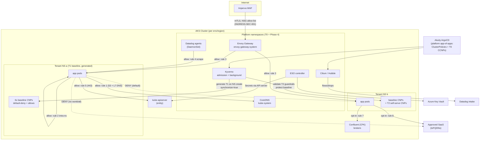

# PRD-2026-NETPOL-ZT-001 — Zero-Trust Network Segmentation (Default Deny)

| Field | Value |
|---|---|
| **Status** | Draft v0.1.0 |
| **Owner** | Platform Engineering |
| **Related** | PRD-2026-KYVERNO-POLICY-001, PRD-2026-INGRESS-SEC-001, PRD-2026-DD-TENANT-NS-001 |
| **Target environments** | dev → nonprod → prod (West US 3, East US) |
| **Scope** | All tenant namespaces (~100 tenants); platform namespaces in Phase 4 |

---

## 1. Problem statement

The platform currently operates in Cilium's `default` policy enforcement mode with effectively no tenant-scoped network policy. Any pod can reach any other pod across all ~100 tenant namespaces, all platform namespaces, the node network, and the internet. This violates least-privilege, provides no lateral-movement containment if a tenant workload is compromised, and is a recurring audit finding.

We will implement **identity-based zero-trust segmentation** using CiliumNetworkPolicy (CNP), with a **default-deny posture per tenant namespace** and an explicitly enumerated allow-list for the platform's known traffic paths. Policy lifecycle is fully GitOps-managed: a Kyverno `generate` policy stamps the baseline policy set into every tenant namespace, Kyverno `validate` guardrails constrain what tenants may self-serve, and Chainsaw provides CI regression coverage for the policy suite itself.

## 2. Goals

1. Every tenant namespace is default-deny for **both ingress and egress** at L3/L4, with DNS-aware (L7) egress control to enable FQDN-based allow rules.
2. Baseline connectivity (DNS, intra-namespace, Envoy Gateway ingress, Datadog scraping, kube-apiserver, health probes) works with zero tenant action on day one.
3. Tenants can self-serve **additional** CNPs within guardrails (no `0.0.0.0/0`, no `world`/`all` entities, no cluster-wide policies, no multi-`specs` documents) — validated by Kyverno at admission.
4. Baseline policies are tamper-proof: Kyverno `synchronize` reverts drift, and a protection policy blocks tenant mutation/deletion.
5. Rollout is observable and reversible at every step: audit-first via `enableDefaultDeny: false` + Hubble flow export to Datadog, then per-wave enforcement.
6. The policy suite is regression-tested in CI with Chainsaw against a kind + Cilium + Kyverno cluster.

## 3. Non-goals

- L7 HTTP policy between tenant services (future; requires per-tenant traffic contracts).
- mTLS / mutual authentication (tracked separately; Cilium mutual auth is not yet in scope).
- Host firewall / `CiliumClusterwideNetworkPolicy` with `nodeSelector` (node-level policy is out of scope; NSG controls from PRD-2026-INGRESS-SEC-001 cover the perimeter).
- Replacing NSG/Imperva perimeter controls — this PRD is the **in-cluster** east-west layer that complements them.
- Egress gateway / SNAT IP pinning (covered in the NKP Cilium egress work; not required for AKS zero-trust).

## 4. Design overview

### 4.1 Layering model

Policy is delivered in three tiers, each with a distinct owner and change process:

| Tier | Kind | Owner | Delivery | Examples |
|---|---|---|---|---|
| **T0 Cluster** | CiliumClusterwideNetworkPolicy | Platform | ArgoCD (platform app-of-apps) | Cilium health checks, kube-dns ingress |
| **T1 Tenant baseline** | CiliumNetworkPolicy | Platform via Kyverno `generate` | Admission-time generation, `synchronize: true` | default-deny, DNS egress, intra-ns, Envoy ingress, Datadog, apiserver |
| **T2 Tenant self-serve** | CiliumNetworkPolicy | Tenant | Tenant config-repo → ArgoCD | app→app cross-ns, FQDN egress, Kafka egress |

T1 is generated rather than rendered into each tenant's config repo so that (a) baseline changes roll out atomically without 100 tenant PRs, (b) tenants cannot remove their own default-deny, and (c) namespace creation via the Copier onboarding flow gets policy automatically with no template coupling.

### 4.2 Identity and selection

- Tenant namespaces carry `platform.example.com/tenant: "true"` (already stamped by the Copier onboarding template's namespace manifest — confirm label key against `provisioning.yaml` conventions before merge).
- All generated CNPs carry `platform.example.com/policy-tier: baseline` and `app.kubernetes.io/managed-by: kyverno` — these labels drive the protection policy and Datadog/KSM dashboards.
- Peer selection uses Cilium identity labels (`k8s:io.kubernetes.pod.namespace`, `fromEndpoints`/`toEndpoints`), never IPs, except for the kube-apiserver (`toEntities: kube-apiserver`) and opt-in FQDN egress.

### 4.3 Baseline traffic matrix (T1)

| # | Direction | Peer | Ports | Rationale |
|---|---|---|---|---|
| 0 | ingress+egress | — (deny) | — | Default deny both directions |
| 1 | egress | kube-system / kube-dns (CoreDNS) | 53/UDP+TCP, L7 DNS `matchPattern: "*"` | Name resolution; L7 rule enables Hubble DNS visibility and future `toFQDNs` |
| 2 | ingress+egress | same namespace | any | Intra-tenant app traffic (tenant apps are single-namespace per env) |
| 3 | ingress | envoy-gateway-system | any TCP | North-south via Envoy Gateway (Imperva → NSG → Envoy → tenant); operator-managed HTTPRoutes target arbitrary tenant ports |
| 4 | ingress | datadog agents | any TCP | OpenMetrics/annotation-based scraping of tenant pods by node-local agents |
| 5 | egress | `kube-apiserver` entity | 443/TCP | Workload identity token exchange, operators/SDK clients in tenant namespaces |
| 6 | ingress | `host` entity | any | kubelet liveness/readiness probes (defensive; also covered by Cilium's default localhost allowance) |

Opt-in (T2 templates shipped in-repo, applied by tenants):

| # | Direction | Peer | Ports | Rationale |
|---|---|---|---|---|
| 7 | egress | confluent namespace (Kafka brokers) | 9071/9092/TCP | CFK consumers/producers |
| 8 | egress | `toFQDNs` allow-list | 443/TCP | External SaaS APIs; requires rule 1's L7 DNS visibility |
| 9 | ingress/egress | named peer tenant namespace | scoped ports | Cross-tenant service calls, explicit both sides |

Note on rule 2/3 semantics: Cilium requires **both** sides to permit a flow once both endpoints are in default-deny — the baseline therefore grants tenant-pod ingress from Envoy, and the platform-side Envoy namespace policy (T0/platform app) grants Envoy egress to tenant namespaces.

Note on ESO: secrets are delivered by the **central** ESO controller reaching Azure Key Vault and writing `Secret` objects via the API server — no tenant-pod network path is involved, so no baseline rule is required. Same for ArgoCD/Akuity agent sync (API-server mediated).

### 4.4 Guardrails (Kyverno validate, tier T2)

Applied to CNPs in tenant-labeled namespaces, excluding the Kyverno background controller and platform admin group:

1. **No unbounded CIDRs** — `toCIDR`/`toCIDRSet`/`fromCIDR`/`fromCIDRSet` may not contain `0.0.0.0/0` or `::/0`.
2. **No broad entities** — `fromEntities`/`toEntities` may not contain `all`, `world`, or `cluster`. External egress must use `toFQDNs`; cross-namespace traffic must name the peer namespace.
3. **No multi-spec documents** — top-level `specs` is disallowed (keeps validation tractable; one intent per resource).
4. **No cluster-scoped policy from tenants** — `CiliumClusterwideNetworkPolicy` creation restricted to platform identities (defense-in-depth on top of RBAC).
5. **Description required** — `spec.description` must be set (audit trail; mirrors ADR conventions).
6. **Baseline protection** — UPDATE/DELETE of `policy-tier: baseline` CNPs blocked for non-platform, non-Kyverno identities.

### 4.5 ArgoCD interaction

Generated T1 policies are cluster-mutated resources from ArgoCD's perspective only if a tenant Application also tries to manage them — it must not. Tenant config-repo templates must **not** render baseline CNPs. The existing global `ignoreDifferences` + `RespectIgnoreDifferences=true` pattern (from the Kyverno/ArgoCD interaction design) needs **no new entries**, since Kyverno generates net-new resources rather than mutating Argo-managed ones. The Kyverno ClusterPolicies themselves and the T0 CCNPs ship through the platform app-of-apps.

## 5. Rollout plan

Mirrors the three-phase Kyverno enforcement playbook (PRD-2026-KYVERNO-POLICY-001):

**Phase 1 — Audit (dev, 2 weeks).** Deploy the full T1 set with `enableDefaultDeny: {ingress: false, egress: false}` patched into the default-deny policy via a Kustomize overlay. All allow rules are live (no-ops in allow-all mode), Hubble flow logs export to Datadog, and a `policy_match_type` monitor identifies traffic that would be dropped. Exit criterion: zero unexplained would-be drops for 7 consecutive days per namespace.

**Phase 2 — Tenant education (2 weeks, overlapping).** Publish the traffic matrix, self-serve CNP templates (opt-in rules 7–9), and per-tenant Datadog dashboard panels (extend PRD-2026-DD-TENANT-NS-001 group set with a network-policy group: drop counts, DNS deny rate, policy resource health via KSM). Tenants with flagged flows file allow-rule PRs against their config repos.

**Phase 3 — Rolling enforcement.** Flip `enableDefaultDeny` to true per wave: dev all-tenants → nonprod by tier (XS/S → M → L/XL, using the sizing framework) → prod by tier with 48h soak between waves. Rollback is a single-field Git revert per wave; Cilium applies policy changes without pod restarts.

**Phase 4 — Platform namespaces.** Apply equivalent hand-authored baselines to platform namespaces (ESO→AKV 443 egress, Envoy→tenant egress, Datadog→intake FQDNs, Akuity agent→Akuity FQDNs, CFK broker/ZK/SR paths). Tracked as a follow-on epic; higher blast radius, done last with the enforcement muscle memory from Phases 1–3.

## 6. Observability

- **Hubble** metrics + flow export → Datadog: `hubble_drop_total` by namespace/reason, `hubble_dns` deny rate, `policy_match_type=4` (allow-all matches) during audit.
- **KSM custom-resource state** (existing pattern): CNP count per namespace, Kyverno `PolicyReport` pass/fail for guardrails, generate-rule failure events.
- **Monitors:** drop-rate spike per tenant namespace post-enforcement (page platform), guardrail denial rate (informational), Kyverno background-controller error rate (page platform).

## 7. Testing

- **Chainsaw (CI, kind + Cilium + Kyverno):** generation on namespace create, `synchronize` self-heal on baseline deletion, guardrail rejection matrix (unbounded CIDR, broad entities, multi-spec, missing description), guardrail acceptance of a correctly scoped policy, baseline mutation protection. Suite runs in the policy repo's ADO pipeline on every PR (same harness pattern as the Kyverno rollout repo).
- **Connectivity smoke (post-deploy, per wave):** `cilium connectivity test` subset plus scripted probes: intra-ns allow, cross-tenant-ns deny, Envoy→tenant allow, tenant→internet deny, tenant→approved-FQDN allow, DNS resolve allow.

## 8. Risks

| Risk | Likelihood | Mitigation |
|---|---|---|
| Unknown east-west dependency breaks at enforcement | High | Audit-first with Hubble; per-wave rollout; single-field rollback |
| DNS L7 proxying adds latency / proxy becomes a failure point | Medium | Measure in dev during audit; `matchPattern: "*"` keeps proxy logic trivial; standalone DNS proxy HA is available on current Cilium versions — validate agent-restart behavior in dev |
| Kyverno background controller lacks RBAC for cilium.io kinds | Certain (must fix) | Ship aggregated ClusterRole (`rbac/`) with the policy bundle; Chainsaw covers generation e2e |
| Tenant creates conflicting allow policy that widens exposure | Medium | Guardrails block entities/CIDR wildcards; PR review plugin (`kyverno`/`kubernetes-base` skills) extended with a `cilium` plugin for CNP review |
| Envoy Gateway namespace policy (platform side) forgotten → all north-south breaks | Medium | Phase 4 dependency ordering: platform-side Envoy egress allow ships in Phase 1 alongside T1 |
| KSM/Datadog agent label drift breaks rules 3–4 | Low | Selectors use namespace labels + stable agent labels; covered by connectivity smoke |

## 9. Success metrics

- 100% of tenant namespaces carry the full T1 set (KSM gauge = 6 baseline CNPs × namespaces).
- 0 sev-1/sev-2 incidents attributable to enforcement waves.
- ≥ 95% of would-be-drop flows identified in audit are resolved (allow-rule PR or confirmed-unwanted) before that namespace's enforcement wave.
- Cross-namespace reachability test (unauthorized path) fails 100% of the time post-enforcement.
- Guardrail admission latency p99 < 200ms (Kyverno webhook budget unchanged).

## 10. Architecture



Solid edges are explicitly allowed paths (rule numbers from §4.3); dashed edges are representative default-deny outcomes.

## 11. Deliverables in this bundle

```
policies/cilium/clusterwide/     T0 — CCNPs (health checks, kube-dns ingress)
policies/cilium/tenant-baseline/ T1 — reference copies of the generated set
policies/cilium/tenant-optional/ T2 — opt-in templates for tenants
policies/kyverno/                generate + guardrails + protection ClusterPolicies
rbac/                            aggregated ClusterRole for Kyverno background controller
tests/chainsaw/                  CI regression suite
```

## 12. Open questions

1. Confirm the canonical tenant namespace label key against the Copier `provisioning.yaml` ledger (`platform.example.com/tenant` is a placeholder).
2. Do any tenants run cross-namespace *today* (multi-namespace tenants)? Audit phase will surface this; may warrant a first-class T2 template.
3. Datadog agent scrape path: confirm agents run without hostNetwork on our chart values — if hostNetwork is enabled, rule 4 must switch to `fromEntities: [host, remote-node]`.
4. Cilium version pin: `enableDefaultDeny` requires ≥ 1.15 — verify the AKS BYOCNI Cilium version across all clusters before Phase 1.
